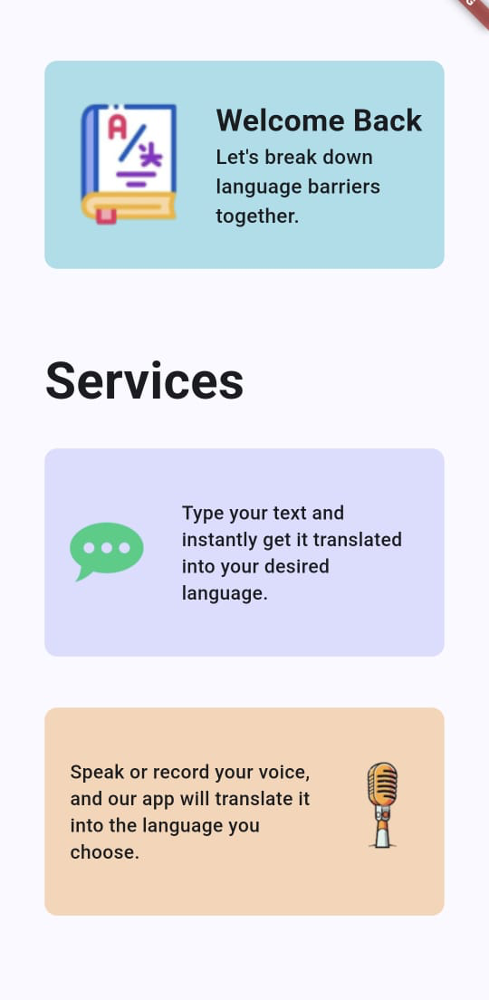
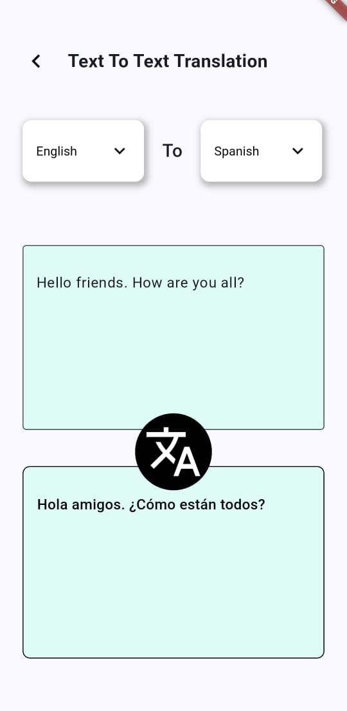
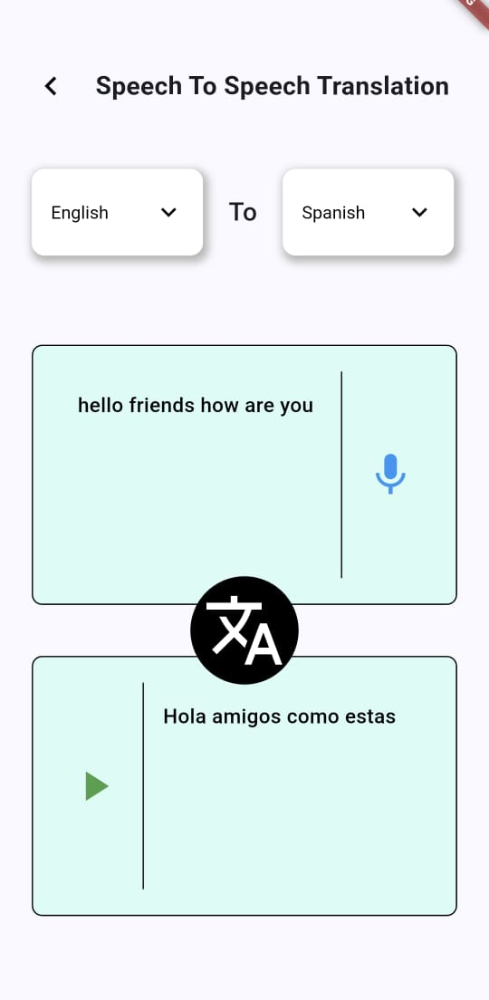

<h1 style="font-size: 40px;">Translator App using Flutter</h1>
 

Preview

    
    
    

  

Overview

The Flutter Translator App is a versatile and user-friendly translation tool that supports both text-to-text and voice-to-voice translations. With its seamless design and powerful features, it bridges the gap between languages, providing instant and accurate translations for users. Built using Flutter and leveraging the translator library, the app ensures smooth functionality and a delightful user experience.

 

Features

1. Text to Text Translation

<ul>
    <li style="font-size: 16px; margin-bottom: 3px;">Users can type text in the input box.</li>
    <li style="font-size: 16px; margin-bottom: 3px;">The typed text is translated into the selected target language.</li>
    <li style="font-size: 16px; margin-bottom: 3px;">Translated text is displayed in the output box.</li>
</ul>

2. Speech to Speech Translation

<ul>
    <li style="font-size: 16px; margin-bottom: 3px;">Users can click the microphone icon to start speech recognition.</li>
    <li style="font-size: 16px; margin-bottom: 3px;">Recognized speech is displayed in the input text box in real-time.</li>
    <li style="font-size: 16px; margin-bottom: 3px;">Clicking the microphone again stops the recognition and triggers translation.</li>
    <li style="font-size: 16px; margin-bottom: 3px;">Translated text is displayed in the output box and narrated aloud.</li>
    <li style="font-size: 16px; margin-bottom: 3px;">A play button allows users to replay the narrated translation.</li>
</ul>
 

Technologies Used

<ul>
    <li style="font-size: 16px; margin-bottom: 3px;"><b>Flutter:</b> Cross-platform framework for building the app.</li>
    <li style="font-size: 16px; margin-bottom: 3px;"><b>Translator Library:</b> For handling translations.</li>
    <li style="font-size: 16px; margin-bottom: 3px;"><b>Speech-to-Text and Text-to-Speech libraries:</b> For voice input and output functionality.</li>
</ul>